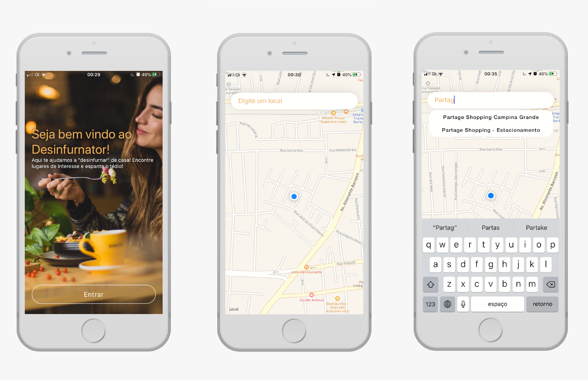

# Desinfurnator

Aplicação mobile em React Native para localização de locais de interesse

## Requisitos

* [NPM](https://www.npmjs.com/get-npm)
* [Yarn](https://yarnpkg.com/)
* [XCode (iOS)](https://developer.apple.com/xcode/)
* [CocoaPods (iOS)](https://cocoapods.org/)
* [Android Studio (Android) + SDK Tools](https://developer.android.com/studio)

## Instruções para Instalação:

1. Executar o comando `yarn install` para instalar as dependências

2. Executar na plataforma desejada:

### Android
* Executar o comando `react-native run-android`

### iOS
* Executar no terminal o comando `pod install`
* Abrir aplicação (xcworkspace) no XCode
* executar no simulador ou dispositivo

## Problemas conhecidos 🐞:

* Viewfinder do mapa não muda ao selecionar local (iOS, Android)
* Indicadores de locais próximos não funciona (iOS)
* Fonte QuickSand não encontrada (iOS)
